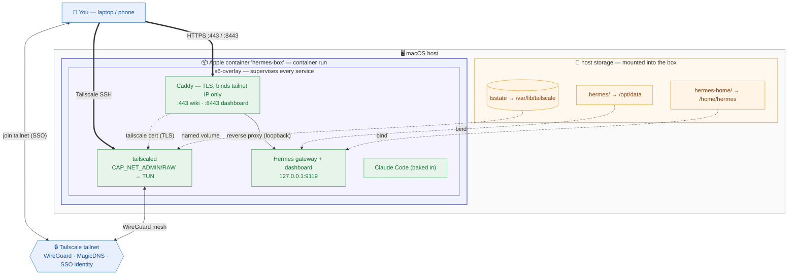

# Hermes box

> Self-hosted, fully scripted runtime for the [Hermes](https://hub.docker.com/r/nousresearch/hermes-agent)
> AI agent on macOS — reachable over a private [Tailscale](https://tailscale.com) tailnet, with
> TLS-fronted web access and encrypted offsite backups. Everything (build, run, backup, auto-start)
> is an idempotent, committed shell script; nothing is configured by hand.

**The box *is* the Hermes runtime.** A single container on macOS (Apple's `container`
CLI) runs the Hermes gateway and `tailscaled` side by side, joined to a private tailnet
and reachable over Tailscale SSH. Its state and work folder are bind-mounted from one
consolidated, backup-friendly data root, and the whole lifecycle — build, run, back up,
auto-start at login — is driven by numbered, re-runnable scripts.

## Motivation

I wanted a Hermes-style **autonomous AI agent** running **always-on in the background** —
a *headless, long-running agentic AI*, not a chat window I sit in front of. The idea: hand
it a brief ("here's the customer, here's the project, here's the direction") and let it go
off and *build* the thing — a website demo, a prototype, a proof of concept — without me
babysitting every step.

The agent was the easy part. The real question was **where to run it**, and I worked
through the options:

- **Cloud VM** — simplest to stand up, but I'd be renting compute 24/7 for something
  that's idle most of the time, with my data living on someone else's box.
- **Raspberry Pi** — cheap, always-on, entirely mine. I actually deployed here first and
  had it running — but the Pi just doesn't have the muscle for real dev work. Building and
  running an Astro site in dev mode was painfully slow.
- **Straight onto the Mac mini (M1)** — all the power I needed, but I wasn't about to let
  an autonomous agent with shell access run loose on my actual machine.
- **Docker on the Mac mini** — proper isolation, but Docker Desktop's VM layer is heavy on
  macOS.
- **Apple's native `container` on the Mac mini** — where I landed.

The Mac mini M1 has the horsepower the Pi lacked, and Apple's `container` runtime gives me
a lightweight, isolated box that taps into it **without compromising the host**. So the
agent runs **always-on**, **comes back up on reboot**, and its accumulated memory and work
are **backed up offsite and encrypted** — a disk failure shouldn't wipe out everything it
has learned and built. This repo is that setup end to end, scripted so it's reproducible
rather than a pile of manual steps I'd never remember.

## Highlights

- **One image, supervised properly.** `FROM nousresearch/hermes-agent`, with Tailscale
  and Caddy added as **s6-overlay** services alongside Hermes' own — no rewrite of the
  upstream image, just extra supervised processes.
- **Private by default.** Caddy is the only network listener and binds to the **tailnet
  IP only**, terminating TLS with a Tailscale-issued cert. The apps stay on loopback;
  the box is never exposed to the public internet.
- **Reproducible & portable.** No hardcoded paths or usernames — every setting is an env
  var with a sensible default derived from the current user/host, overridable via a
  gitignored `.env`. A from-scratch machine comes up from the scripts alone.
- **Durable.** Tailscale identity persists in a named volume (survives recreates);
  encrypted, versioned offsite backups go to Cloudflare R2 via restic on a daily timer.
- **Self-checking.** `scripts/test.sh` is a single non-destructive health check (container
  up, mounts live, gateway responding, SSH + HTTPS over the tailnet) — run after any change.

## Architecture



**Reading the diagram** — dotted edges are mount points (host data → in-box paths);
thick edges are the security-sensitive access flows. Everything arrives over the
encrypted Tailscale tailnet — SSH to `tailscaled`, HTTPS to Caddy, which binds the
**tailnet IP only** — so the box never exposes a public port. (The backup pipeline is
diagrammed in the [operations manual](docs/OPERATIONS.md#backups).)

`container run` (not `container machine`) is used deliberately: it gives real `--volume`
bind mounts of arbitrary host folders, and `--cap-add CAP_NET_ADMIN/CAP_NET_RAW` lets
`tailscaled` create its TUN device.

## Quick start

```bash
cp .env.example .env            # optional per-machine overrides
./scripts/00-prereqs.sh         # container CLI up
./scripts/01-build.sh           # build local/hermes-box:latest from image/
./scripts/migrate-data.sh       # ONE-TIME: consolidate ~/.hermes + hermes-home (box stopped)
./scripts/02-run.sh             # run: Hermes gateway + Tailscale, with volumes + ports
./scripts/03-tailscale-up.sh    # open the printed URL to authenticate (first run only)
./scripts/test.sh               # canonical health check
```

Then reach Hermes at `http://localhost:9119`, shell in with
`container exec -it hermes-box bash`, or over the tailnet with `ssh hermes@hermes-box`.
Web access (wiki + dashboard) is served by Caddy over HTTPS on the tailnet — see the
[operations manual](docs/OPERATIONS.md#web-access-caddy-over-the-tailnet).

## Repository layout

```
image/      build context — Dockerfile + s6/{tailscaled,caddy}/ + caddy/Caddyfile
lib/        common.sh — env-driven config + .env loader
scripts/    00–04, test.sh, migrate-data.sh           # lifecycle
  backup/     backup.sh restore.sh cf-r2-setup.sh restic*.sh restic-schedule-*.sh
  autostart/  boot.sh install.sh uninstall.sh         # launchd at login
  builder/    stop.sh reset.sh                         # BuildKit RAM/disk
docs/       OPERATIONS.md — backups, config, auto-start, troubleshooting
.env.example  cf.env.example  restic.env.example       # templates (real ones gitignored)
CLAUDE.md  ROADMAP.md
```

## Conventions

All work here is **scripted, idempotent, and documented** — no manual mutation of the
box. Every change goes through a committed script, `scripts/test.sh` is the canonical
check, and secrets live only in gitignored `.env` / `cf.env` / `restic.env`. The full
rules are in [`CLAUDE.md`](CLAUDE.md).

## Documentation

- [**Operations manual**](docs/OPERATIONS.md) — data layout, backups (restic → R2),
  full configuration reference, Claude Code in the box, auto-start, troubleshooting,
  and teardown.
- [`CLAUDE.md`](CLAUDE.md) — working conventions for changes to this repo.
- [`ROADMAP.md`](ROADMAP.md) — what's done and what's next.

## License

[MIT](LICENSE)
